# T3A2 - Full Stack App (Part A)

by Callum Worrall, Rachel Williams and Tom Fisher

## R1. Description of your website, including: Purpose, Functionality/Features, Target Audience and Tech Stack.

**FlexiDesk** allows LEAPDev to accurately plan and manage who is in the office each day thus protecting the entire company by knowing exactly who was at each desk and when. 

This self-serve technology lets employees manage themselves with easy, on-the-fly bookings based on what is available and what social distancing requirements are in place. 

Say goodbye to dedicated team days, spreadsheets and no-shows! FlexiDesk enables a safe return to work solution at the click of a button.

## **Purpose**

The purpose of FlexiDesk is to provide our client, LEAPDev, an application that they can introduce to their 130 employees to book 60 COVID friendly workspaces. 

LEAPDev currently has set days for teams to come in, however not all team members show up. Workspaces are going to waste as only 10% of desks are being used on team days. This system is not cost effective and does not provide a flexible working solution to employees. By using FlexiDesk it will increase the percentage of desks being used by allowing more people to book available COVID friendly workstations whenever. 

In addition to this, the People and Cultural team and senior management are able to see an overview on:

- Social distancing 

- Contact Tracing 

- View and manage who is coming in when 

- View who is sitting where

- Better manage cleaning and maintenance on used workstations
- Make better cost effective decisions

Overall, FlexiDesk is a cost effective solution that focuses on employee well-being by increasing opportunity for flexible working and desk utilisation. 

## **Functionality and Features**

With an easy to use interface, employees can securely log in and be displayed with a booking calendar in a matter of seconds.

The FlexiDesk application has been designed to be quick and efficient for:

- Booking workstations - with only limited information required when securing a booking.
- Booking management - where employees can manage and track their bookings all in one location. 

The People and Cultural team can securely log in with Admin rights to view analytics at a high-level, such as tracking employee bookings and contact tracing.

The MVP features of FlexiDesk are:

| **Feature**                      | **User**       | **Functionality**                                            |
| -------------------------------- | -------------- | ------------------------------------------------------------ |
| **Secure Login / Sign Out**      | Employee/Admin | Securely log in  with credentials and sign out once signed in |
| **Account Setup**                | Admin          | Admins will be  able to create/edit accounts for employees with the following information: - First name - Last Name - Email Address - Phone - Company - Team division - Level of Access |
| **Floorplan Preview**            | Employee/Admin | Employees will be  able to see the floor plan of what desks are available. Admin will be able to amend the floorplan . |
| **Booking Calendar**             | Employee/Admin | Employees will be  able to select a day and view available seats and unavailable seats. Admins will be  able to book on behalf of a staff member. |
| **Booking Form**                 | Employee/Admin | Upon booking the  required fields are needed in order to secure the workstation: 1.  Have you travelled outside of NSW in the past 14 days? 2. Have you had any flu-like symptoms?3. Have you been tested for COVID in the past 14 days? 4. I consent that the information above is true. |
| **Recurring  Appointments**      | Employee/Admin | Employees with an  access level of 3 or higher can reserve an office/desk permanently or  recurring. |
| **Restrictions  Access Level 1** | Employee       | Employees with  access level of 1 can only book two weeks in advance and two days a week max. |
| **Restrictions  Access Level 2** | Employee       | Employees with  access level of 3 can only book two weeks in advance and five days a week max. |
| **Reminder Emails**              | Employee       | Reminder email  will be sent 12/24 hours prior to booking with the option to modify/delete. |
| **Staff Dashboard**              | Employee       | Ability to:      1. Book a new workstation   2. Edit an existing booking     3. Delete an existing booking   4. View past bookings   5. View present/future bookings   6. Analytics |
| **Admin Dashboard**              | Admin          | Admin dashboard for  P&C team with the ability view an overall of activity happening with  bookings such as:     - Analytics on past/present/future bookings - Analytics per workstation    - Analytics per employee    - Analytics per team    - Ability to search by name/workstation     In addition to  this, they will have the functionality to:      - Book on behalf of an employee    - Delete/ edit existing bookings     - Ability to add/remove/edit desks - Ability to add/edit photos of desks |

## **Target Audience**

The are two types of target audience for FlexiDesk, for employees and HR/Senior Management:

1. Employees who want more flexibility for when they desire to come into the office.

2. Senior Management and HR to:
   - Easily track and manage COVID friendly workspaces for social distancing purposes 
   - Contact Tracing in case someone has or knows someone recently infected with COVID
   - Track who is coming in when and where they are sitting
   - Better manage cleaning and maintenance on used workstations
   - Make better cost effective decisions based on seats booked

## Tech Stack

FlexiDesk is a full stack application built on the MERN stack (MongoDB, Express, React and Node) and utilises a range of packages to help with the development time and improving features. 

### Development Tools

- Visual Studio Code
- git
- GitHub
- GitHub Desktop

### Diagrams

- Whimsical (Dataflow Diagrams, Wireframes, Application Architecture Diagram)

### Project Management

- Workona (Link Management)
- Discord (Communication)
- Trello (Task Management)

### Front-End

- React.js
- HTML
- CSS / SCSS

### Back-End

- Express.js
- Node.js

### Deployment

- Heroku (Publishing)
- Netlify (Development)
- GoDaddy (Domain Host)

### Data Storage

- MongoDB Atlas (Database)
- Amazon Web Services S3 (image Uploading)

# R2. Dataflow Diagram

## Administrator Dataflow Diagram

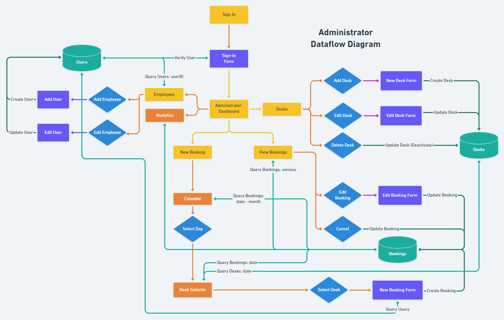

## **Employee Dataflow Diagram**

# R3. Application Architecture Diagram

# R4. User Stories

There are two types of target audience for FlexiDesk with multiple user stories depending on what the end user wants to accomplish and whether they have different permissions.

## Administrator

From an Admin perspective, there are multiple user stories that can occur when using the FlexiDesk application, these are:

### Administrator adding a User

The Administrator is the People and Cultural Team (HR) at LEAPDev. The Admin is required to onboard any new employee that has recently been employed at LEAPDev, therefore they will need to set up accounts such as, FlexiDesk so that the employee can use the application to book an appointment from or before their start date at LEAPDev. 

They will need to:

1. Enter login details into the FlexiDesk application by visiting [www.flexi-desks.com](http://www.flexi-desks.com) 

2. From the navigation menu on the left, they will need to click ‘View Employees’

3. The page will render all employees. The Admin will click on “Add Employee”

4. Upon the click, a form will be displayed where they will be required to add the following details:
   - First Name
   - Last Name
   - Email Address
   - Phone Number
   - Company Name (selector) 
   - Team Name (selector)
   - Access Level
   - Temp Password
5. Upon saving the form, this will create the user with certain permissions. From there the employee can login and make a booking.

### Administrator editing a user

From time to time the Admin will need to edit the employees account details for various reasons:

- Employee no longer works at LEAPDev
- Employee’s details have changed

- Employee’s level of access has changed

- Employees Team has changes

To make any of these actions, they will need to:

1. Enter login details into the FlexiDesk application by visiting [www.flexi-desks.com](http://www.flexi-desks.com) 

2. From the navigation menu on the left, they will need to click ‘View Employees’

3. Select ‘edit’ against the Employee they wish to edit

4. Amend the details or deactivate

5. Upon saving they will return to the list

### Administrator Adding a new Desk

The Admin will occasionally be required to add new desks to the floorplan for Employees to book. 

To make this action, they will need to:

1. Enter login details into the FlexiDesk application by visiting [www.flexi-desks.com](http://www.flexi-desks.com) 

2. From the navigation menu on the left, they will need to click ‘View Desks’

3. The page will render all desks. Within here there will be a button ‘Add Desk’

4. The Admin will need to assign a desk number and section

5. Activate desk

6. Upload a photo of the desk

7. Upon saving they will return to the desk list

### Administrator Editing Existing Desk

The Admin will occasionally be required to edit desks based on changes such as COVID, the desk no longer exists or the desk placement has changed on the floor plan.

To make any of these actions, they will need to:

1. Enter login details into the FlexiDesk application by visiting [www.flexi-desks.com](http://www.flexi-desks.com) 

2. From the navigation menu on the left, they will need to click ‘View Desks’

3. The page will render all desks where the Admin can scroll to find a desks, select ‘edit’

4. Amend by deactivating or changing the photo

5. Upon saving they will return to the desk list

### Administrator Booking a Desk

The Admin can be required to book a desk on behalf of someone such as a new employee that does not yet have access or for employees from other offices around the world. The Admin will have the ability to book a desk to reserve a spot for the above reasons. 

To make any of these actions, they will need to:

1. Enter login details into the FlexiDesk application by visiting [www.flexi-desks.com](http://www.flexi-desks.com) 
2. From the navigation menu on the left, they will need to click ‘New Booking’’
3. Select a date
4. Select an available seat
5. Select an Employee
6. Upon saving they will return to the bookings page

### Administrator Reviewing Analytics

Admins require an overview of what is happening in the organization with bookings. They will want to track:

- Who is coming in on what days
- What desks are being booked out
- How many desks are being booked out per day, week or month
- Who is COVID safe

All these analytics will help Admins forecast for budgeting purposes and save money on floor space, track employees that are coming in and if there is a medical breach due to COVID they can contact trace people within the area to isolate. 

To make any of these actions, they will need to:

1. Enter login details into the FlexiDesk application by visiting 
2. The analytics page will automatically be the first rendered page, otherwise if they are on another page, they can access analytics from the navigation menu on the left.
3. From here they can view a variety of analytics

## **Employee**

From an employee perspective, there are various user stories that can occur when using the FlexiDesk application, these are:

### Making a booking

An employee that is wanting to come into the office to work must be required to book a desk via FlexiDesk. 

To do so, they will need to:

1. Enter login details into the FlexiDesk application by visiting [www.flexi-desks.com](http://www.flexi-desks.com) 
2. Click on ‘New Booking’
3. Select a date from the calendar within 2 weeks from today's date 
4. Either view the floor plan to see where the available desks are, or select an available desk
5. The employee must complete the form pop-up in order to reserve the desk. 
6. Upon save, they will be redirected back to the dashboard to see their upcoming bookings
7. An employee will receive an email reminder within 24 hours prior to the booking

### Editing/Deleting an Existing Booking

Employees sometimes need to edit or delete a booking that they have made. They may need to edit the date or delete the entire booking if they cannot come in that day. 

To do so, they will need to:

1. Enter login details into the FlexiDesk application by visiting [www.flexi-desks.com](http://www.flexi-desks.com) 
2. The page will automatically render past and upcoming bookings
3. From here, the User can edit or delete the booking depending on which icon they select

# R5. Wireframes for multiple standard screen sizes, created using industry standard software.

## Wireframe Legend

Below is a legend corresponding to the wireframes.

## Universal Wireframes

### Sign In Page (Universal)

## Administrator Wireframes

### Analytics (Admin)

### View Bookings Page (Admin)

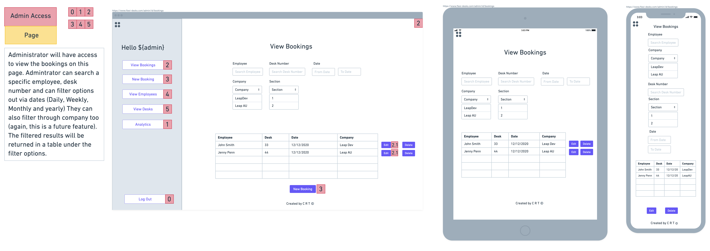

### Edit Booking - Form (Admin)

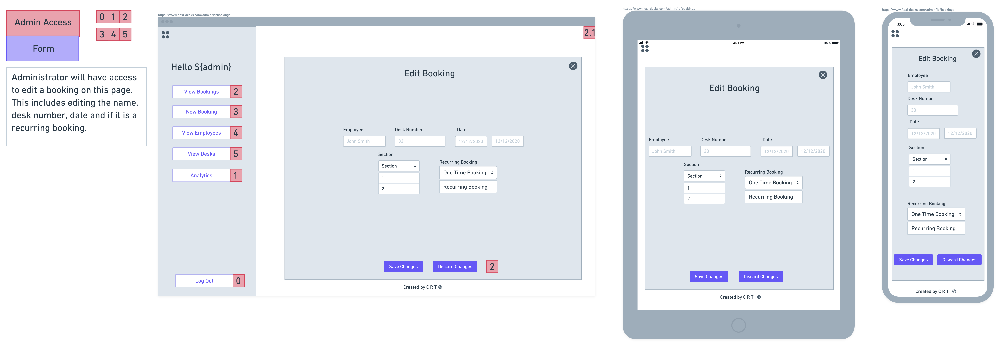

### New Bookings Page (Admin)

### New Booking Form (Admin)

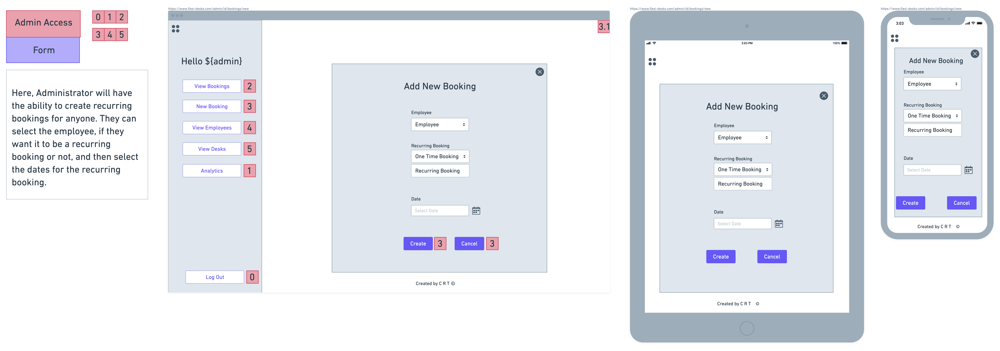

### View Employees Page (Admin)

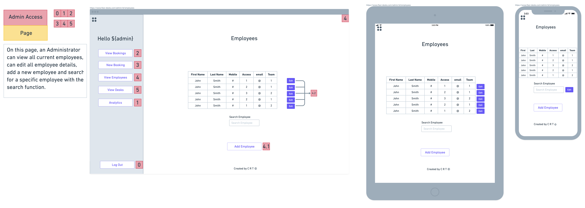

### Add Employee Form (Admin)

### Edit Employee Form (Admin)

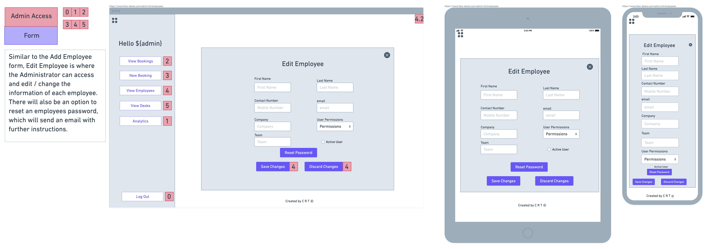

### View Desks Page (Admin)

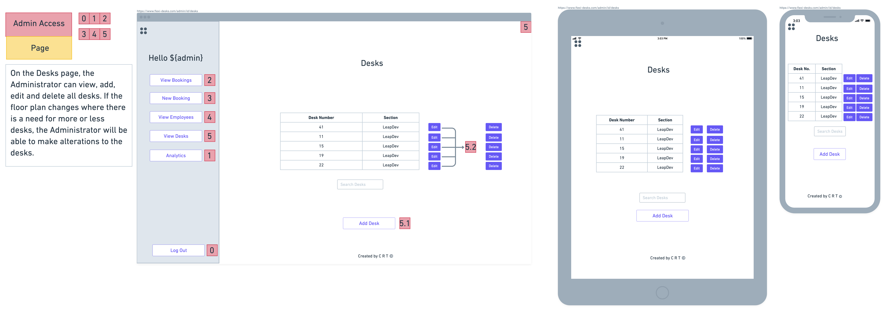

### Add Desk Form (Admin)

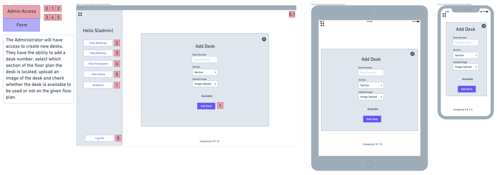

### Edit Desk Form (Admin)

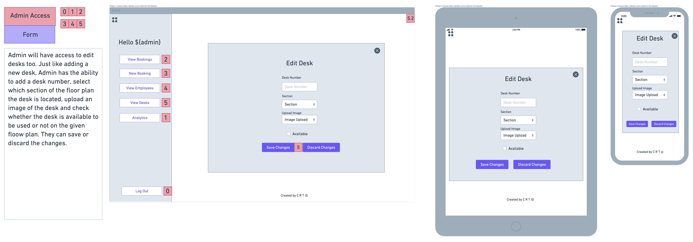

## Employee Wireframes

### Employee Dashboard (Employee)

### Make Bookings (Employee)

### Covid Form (Employee)

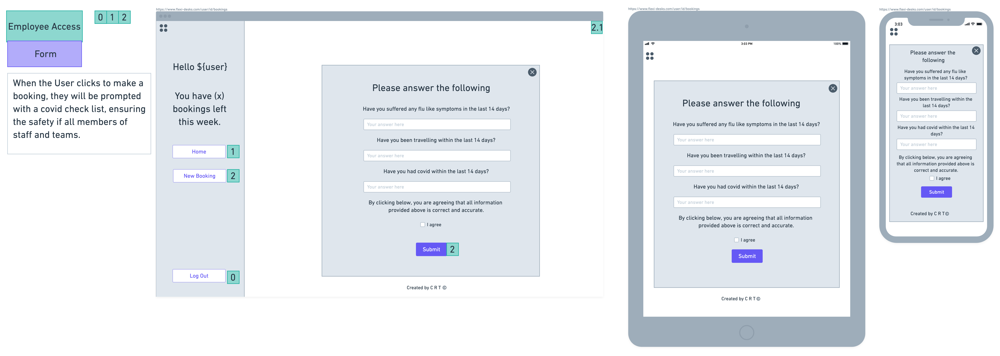

# R6. Screenshots of Trello board throughout the duration of the project.

## Documentation Phase

### 23rd November 2020 - Board Status

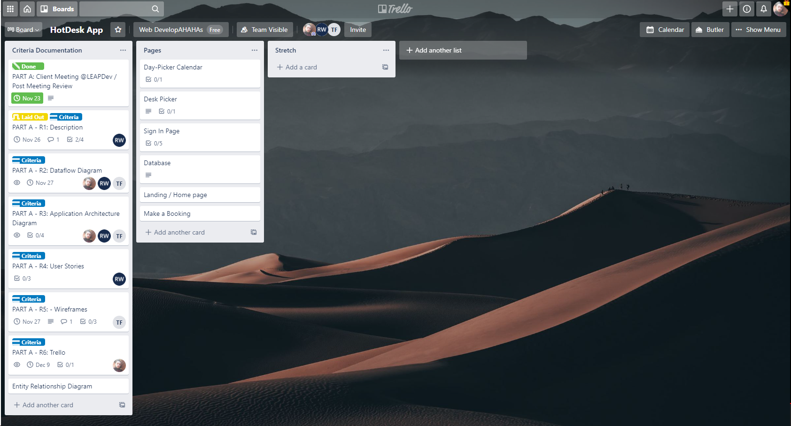

### 24th November 2020 - Board Status

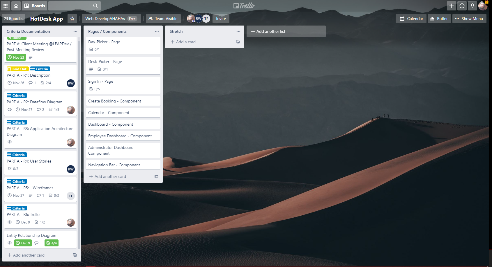

### 29th November 2020 - Dataflow Card

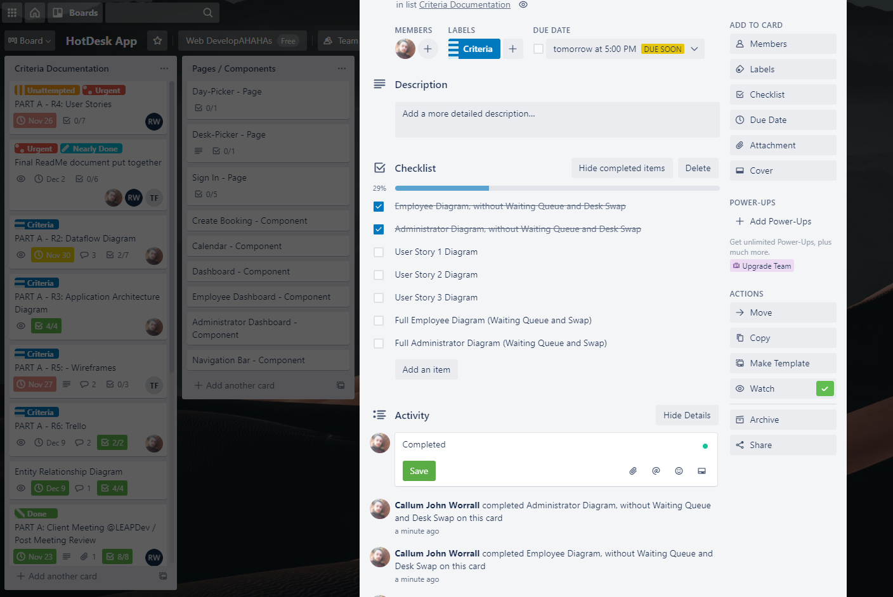

###  30th November 2020 - Dataflow Card

![Trello Screenshot 30th November 2020 [1]](docs/img/trello/30112020(1).png)

### 30th November 2020 - Board Status

![Trello Screenshot 30th November 2020 [2]](docs/img/trello/30112020(2).png)

